<h1 align="center">🔌 Smart Plug </h1>

  Control appliances remotely, monitor power usage, and estimate energy cost in real-time ⚡

<h2>🚀 Features</h2>
<ul>
  <li>🔌 Remote ON/OFF Control</li>
  <li>📊 Real-time Voltage, Current & Power Monitoring</li>
  <li>💰 Energy Cost Estimation</li>
  <li>📅 Scheduling Automation</li>
  <li>☁️ Cloud Integration (MQTT)</li>
  <li>📱 Interactive Dashboard</li>
</ul>

<h2>🛠️ Tech Stack</h2>
<ul>
  <li><b>Hardware:</b> ESP32, Relay Module, Current Sensor, Voltage sensor, registor, transistor, capacitor</li>
  <li><b>Programming:</b> MicroPython</li>
  <li><b>Protocols:</b> MQTT, HTTP</li>
  <li><b>Cloud:</b> Adafruit IO / IFTTT</li>
  <li><b>Backend:</b> Flask </li>
</ul>

<h2>📷 Project Screenshots</h2>

  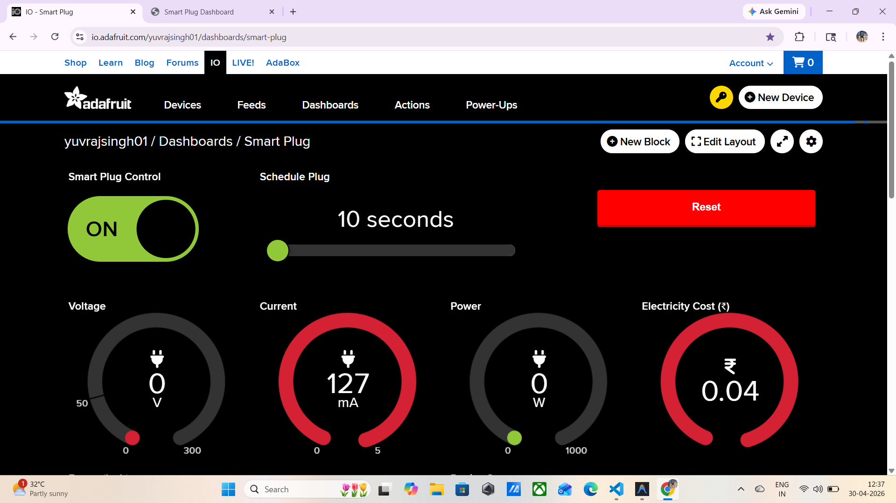
  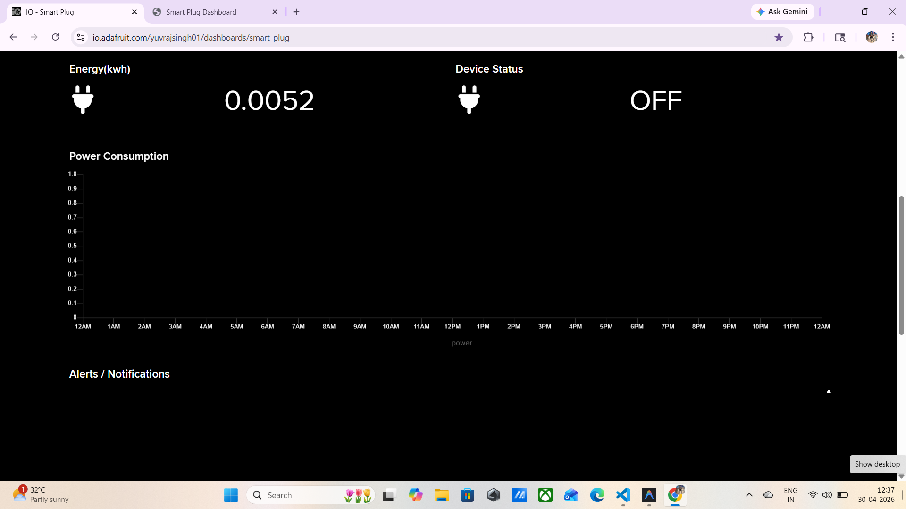
  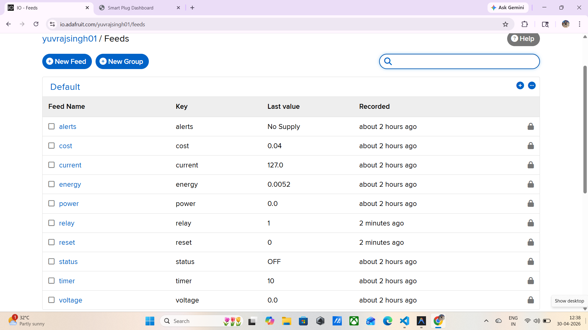
  
  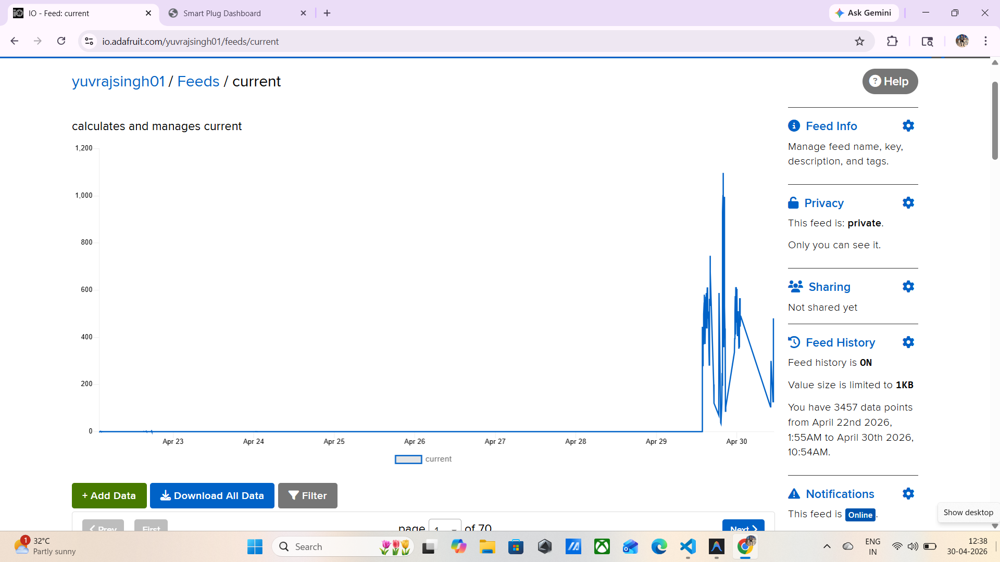
  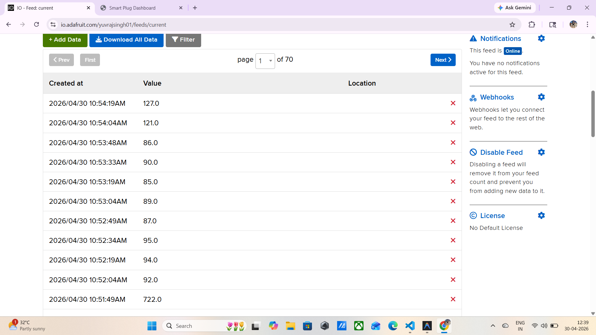
  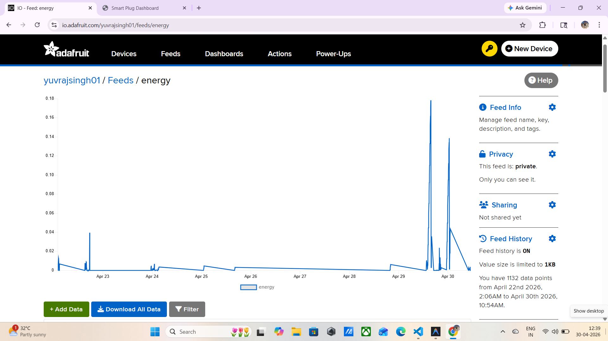
  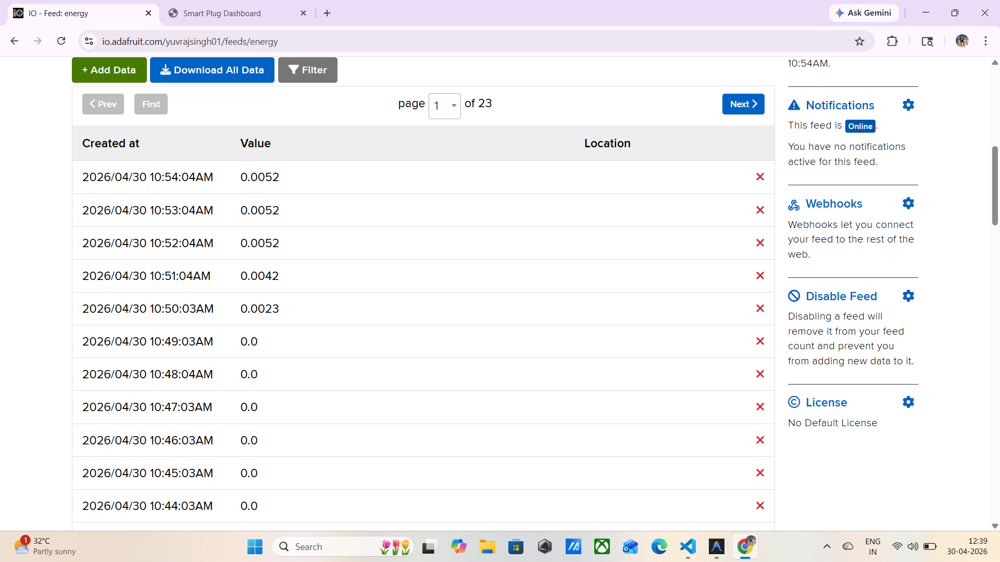
  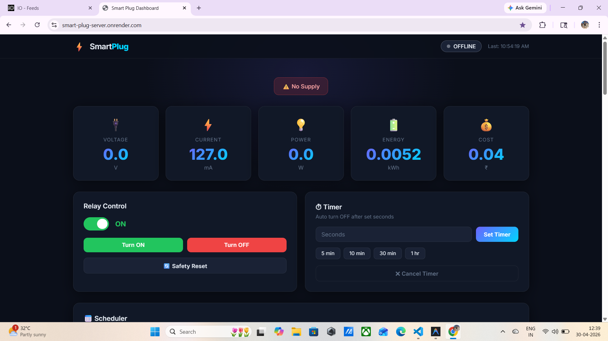
  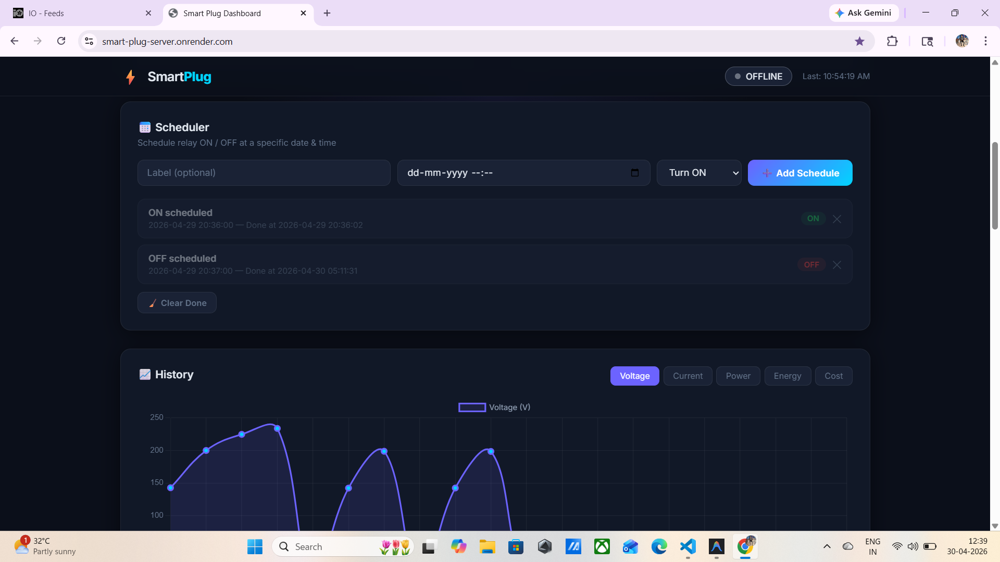
  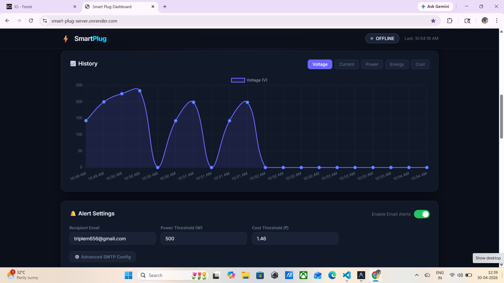
  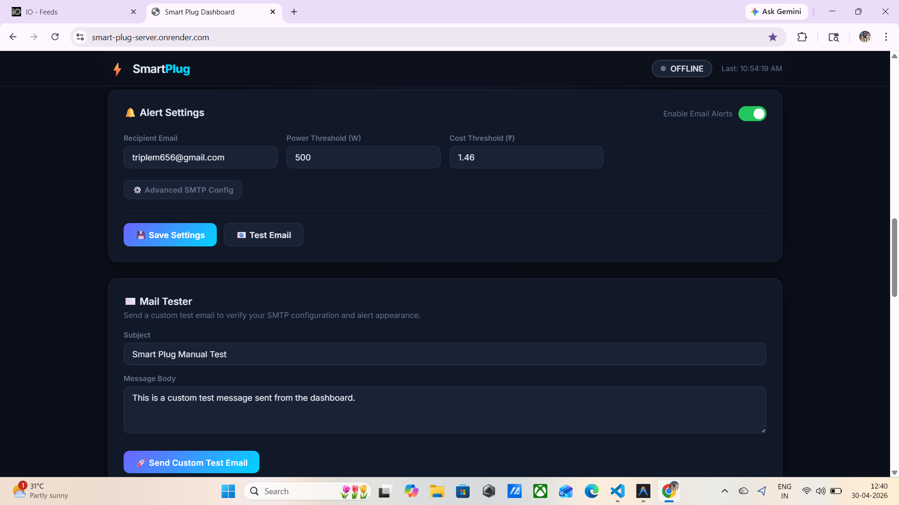
  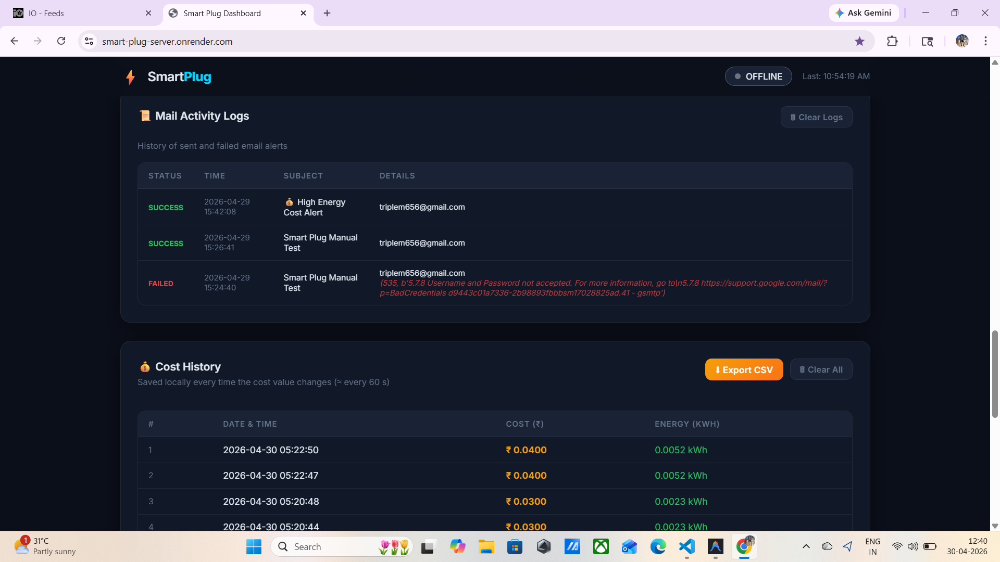
  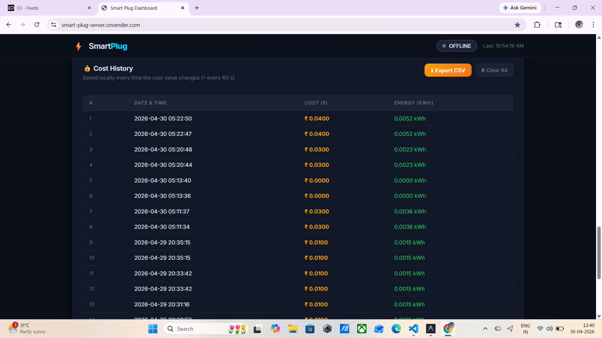
  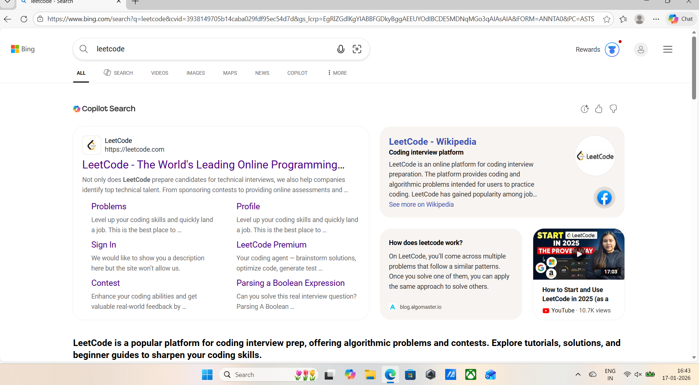
  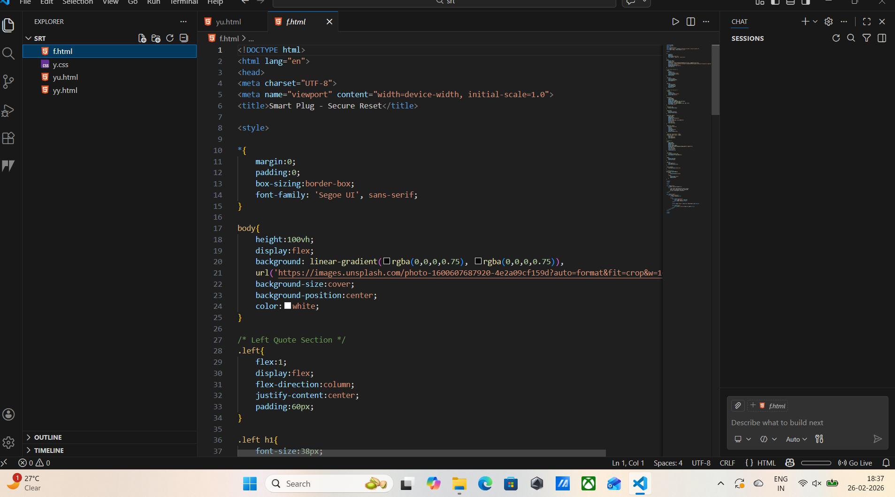
  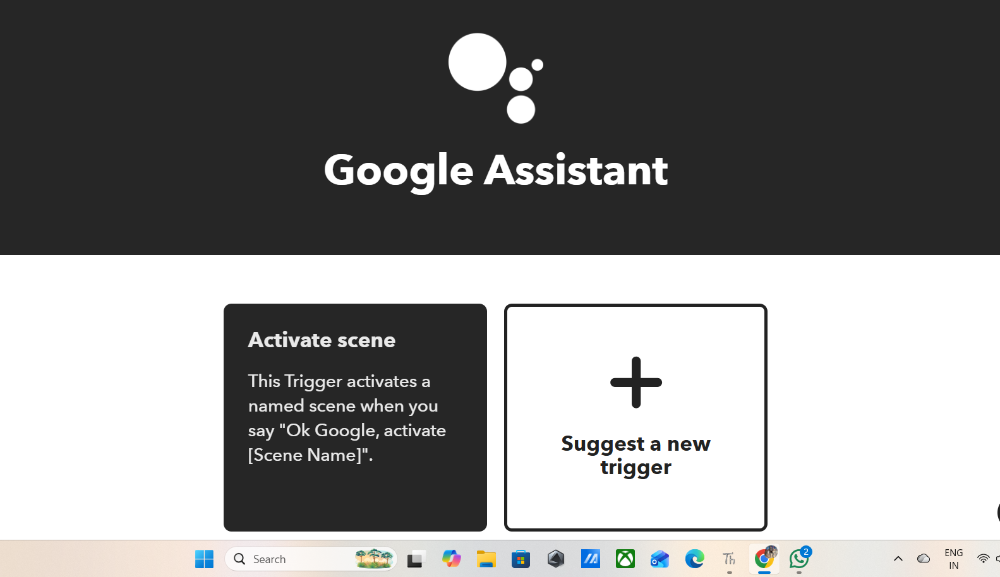
  
  
  
  
  
  
  
  
  
  
  
  
  
  
  
  
  

  
  

<i>📌 Replace images with your actual screenshots</i>

<h2>⚙️ Installation & Setup</h2>

<ol>
  <li><b>Clone Repository</b></li>
</ol>

<pre>
git clone https://github.com/your-username/smart-plug.git
cd smart-plug
</pre>

<ol start="2">
  <li><b>Upload Code to ESP</b></li>
</ol>

<ul>
  <li>Flash MicroPython firmware</li>
  <li>Upload code using Thonny / ampy</li>
</ul>

<ol start="3">
  <li><b>Configure WiFi & MQTT</b></li>
</ol>

<pre>
SSID = "your_wifi"
PASSWORD = "your_password"
MQTT_BROKER = "your_broker"
</pre>

<ol start="4">
  <li><b>Run the Device</b></li>
</ol>

<ul>
  <li>Power ON device</li>
  <li>Open dashboard</li>
  <li>Control appliances</li>
</ul>

<h2>📊 System Architecture</h2>

  <b>Device → MQTT Broker → Cloud Dashboard → User</b>

<h2>📈 Working Flow</h2>

<ul>
  <li>Sensor reads voltage & current</li>
  <li>Data sent to cloud via MQTT</li>
  <li>Dashboard shows real-time data</li>
  <li>User sends ON/OFF command</li>
  <li>Relay switches appliance</li>
</ul>

<h2>🎯 Future Improvements</h2>

<ul>
  <li>📱 Mobile App Integration</li>
  <li>🎙️ Voice Control (Alexa / Google Assistant)</li>
  <li>📊 Advanced Analytics</li>
  <li>🔌 Multi-device Support</li>
</ul>

<h2 align="center">🙌 Thanks for Visiting!</h2>

  ⭐ Star this repo if you like the project!

